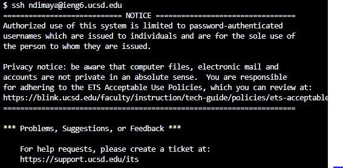

# Lab 7 
---

For **step 4** I input the command `ssh ndimaya@ieng6.ucsd.edu` and hit `<enter>`

---

For **step 5** I input the command `git clone https://github.com/ndimaya/lab7` and hit `<enter>`

---

For **step 6** I input `bash test.sh`

---

For **step 7** I input `vim L` `<tab>`, `<.>`, `java`, then I held the `<down arrow>` until line 44, the `<left arrow>` until I was over the 1, `r`, `2`,`<esc>`, `<shift>`, `<:>`, `wq`, `<enter>`

---

For **step 8** I input `bash test.sh`, `<enter>`

---

For **step 9** I input `git commit L`, `<tab>`, `<enter>`, `i`, `good job`, `<esc>`, `<shift>`, `<:>`, `wq`, `git push L`, `<tab>`, `.java`

