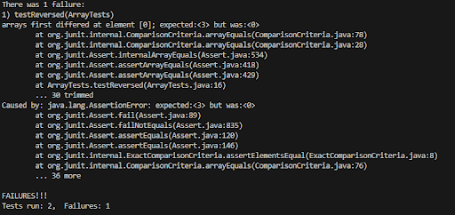

# Lab 3
**Failure**
`There was 1 failure:
arrays first differed at element [0]; expected:<3,2,1> but was:<0>
...(stuff here)
...30 trimmed
caused by: java.lang.AssertionError: expected:<3,2,1> but was:<0>
...(stuff here)
...36 more
Failures!!!
Tests run: 2, Failures: 1`

`public void testReversed() {
    int[] input1 = {1,2,3};
    assertArrayEquals(new int[]{3,2,1}, ArrayExamples.reversed(input1));
  }`

**Passing**
`JUnit version 4.13.2
..
Time: 0.015

OK (2 tests)`

`static void reverseInPlace(int[] arr) {
    int a = arr[0];
    for (int i = 0, i < arr.length, i += 1) {
        arr[i] = arr[arr.length - i - 1];
        }
    arr[arr.length - 1] = a
    }`

