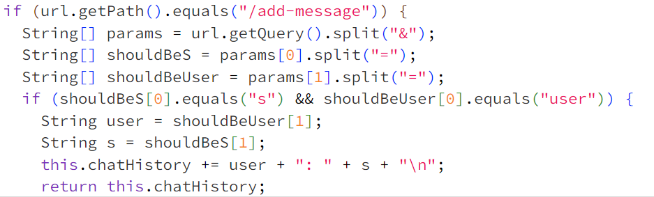
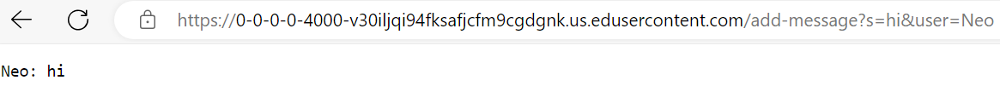
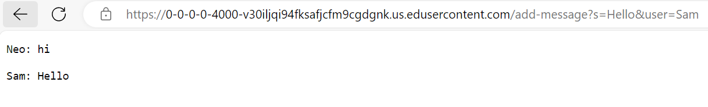

# Week 3 Lab Report

**First Message** for the first `/add-message` the methods called are `getPath` and `getQuery`. The relevant arguments for `getQuery` are "s" and "user" and the relavent argument for `getPath` is "add-message". The value of s is "hi" and the value of user is "Neo". There are non initial values for for s and user so they are changed to the input values of s and user.

**Second Message** for the second use of `/add-message` the methods called are the same as the first as well as `chatHistory`. The relevant arguments for `getQuery` and `getPath` are the same and the argument for chatHistory is the whole string from the first message. The value of s is "Hello" and the value of user is "Sam". The value of chatHistory is the first message. The initial values for s was "hi" which changed to "Hello" and the initial value of user was "Neo" which changed to "Sam". The value of chatHistory changed from "Neo: hi" to "Neo: hi \n Sam: Hello".

