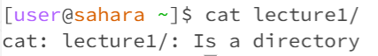
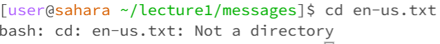
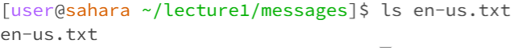

# Week 1 Lab Report
**cd with no arguments** changes the current directory to the home directory

**working directory:** /home

**Explination:** with no arguments the code returns to the default of home. This is not an error

**ls with no arguments** lists the files in the current directory

**working directory:** /home

**Explination:** with no arguments the argument goes to home and lists the files in home. This is not an error.

**cat with no arguments** returns nothing

**working directory:** nothing

**Explination:** with no arguments the code returns nothing. This is an error because nothing can be read and exits the console cursor.

**cd with directory as an argument** changes the current directory to the input directory

**working directory:** /home/lecture1

**Explination:** with the argument of a dirctory the code enters that directory. This is not an error.

**ls with directory as an argument** lists the files of the input directory

**working directory:** /home/lecture1

**Explination:** with the argument of a directory the code lists the files of the directory in this case "messages, Hello.class, Hello.java, and README." This is not an error.

**cat with directory as an argument** prints that the directory is a directory as long as you are not in that directory

**working directory:** /home/lecture1

**Explination:** with the argument of a directory there is not an individual file that can be printed so it is stated that it is a directory. This is an error because it cannot read any files and returns an error message.

**cd with a file** prints out an error stating "Not a directory"

**working directory:** /home/lecture1/messages/en-us.txt

**Explination:** with the argument of a file the code cannot be entered so it is stated that it is a directory. This is an error because a directory cannot be entered and so it returns an error message.

**ls with a file:** returns the input file

**working directory:** /home/lecture1/messages/en-us.txt

**Explination:** with the argument of a file the only thing that can be listed is the file itself. This is not an error.

**cat with a file** prints out the contents of the file

**working directory:** /home/lecture1/messages/en-us.txt

**Explination:** with the argument of a file the contents of the file are printed
