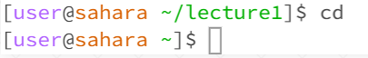
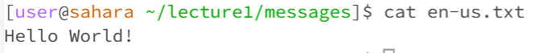

# Week 1 Lab Report
**cd with no arguments** changes the current directory to the home directory

**working directory:** /home

**ls with no arguments** lists the files in the current directory

**working directory** /home

**cat with no arguments** returns nothing

**working directory** nothing

**cd with directory as an argument** changes the current directory to the input directory

**working directory** /home/lecture1

**ls with directory as an argument** lists the files of the input directory

**working directory** /home/lecture1

**cat with directory as an argument** prints that the directory is a directory as long as you are not in that directory

**working directory** /home/lecture1

**cd with a file** prints out an error stating "Not a directory"

**working directory** /home/lecture1/messages/en-us.txt

**ls with a file** returns the input file

**working directory** /home/lecture1/messages/en-us.txt

**cat with a file** prints out the contents of the file

**working directory** /home/lecture1/messages/en-us.txt
